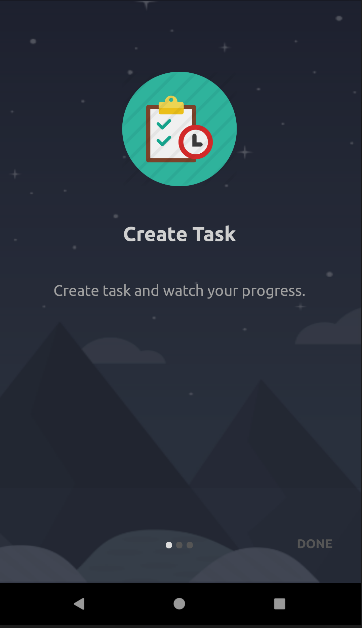
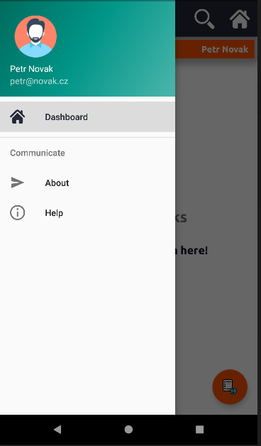
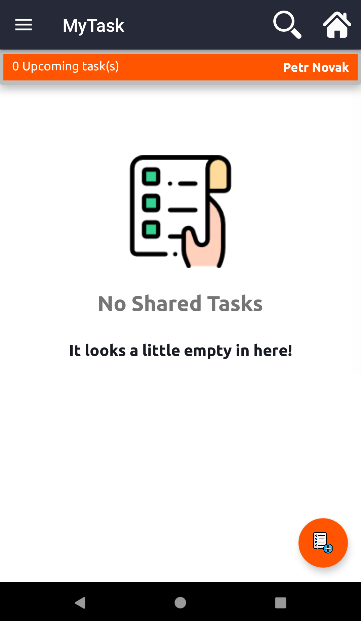
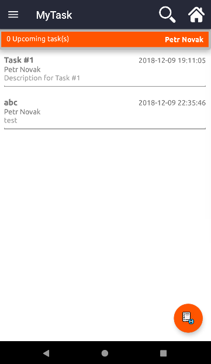
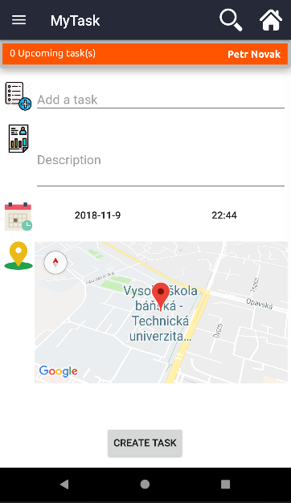
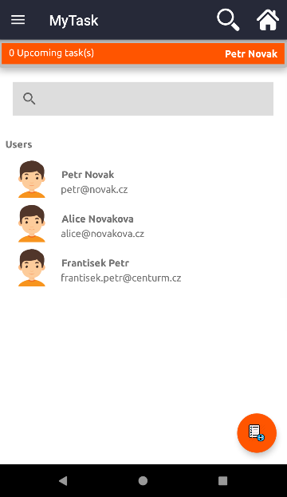

# my-task-mobile

##### *Project to subject TAMZ2*

### Description
   Application which offer to create Task and via API

### Features
- Advanced GUI - Lists, Fragments
- Concurrency - Threads
- Database - SQLite
- Geo Location - Google Maps
- Persistent Storage - SharedPreferences
- Networking - Downloading Data via API (JSON)

### ScreenShots

